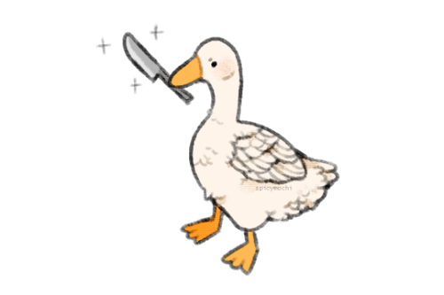

# Knife Goose

> | STR  | CON  | DEX  | INT  | WIS  | CHA  |
> | ---- | ---- | ---- | ---- | ---- | ---- |
> | +2   | +0   | +0   | -3   | -1   | +0   |
> | 14   | 11   | 11   | 4    | -8   | 10   |
>
> **Health** 28
> **Armour Class** 12
> **Speed** 25ft. (25ft. swim, 40ft. fly)
> **Proficiencies** Intimidation +4, Athletics +2

#### Abilities

**Fearless Fowl.** You have advantage on saving throws against being frightened. 

**Hold Breath.** You can hold your breath for 10 minutes while underwater.

**Savage Attacker.** *(1 / Short Rest).* When you roll damage for a melee weapon attack, you can reroll the attack's damage dice and use either total. 

#### Actions

**Beak.** *Melee Attack:* +4 to hit, reach 5 ft., one target. *Hit:* 1d6 + 2 piercing damage.

**Knife.** *Melee Weapon Attack*: +4 to hit, reach 5ft., one target. *Hit:* 1d6 slashing damage.

#### Bonus Actions

**Honk.**  *Special Action (3 / short rest):* You emit a honk at one creature within range. If the target can hear you, it must succeed on a Wisdom saving throw (DC 14) or it will have disadvantage on the next ability check it makes before the end of its next turn.