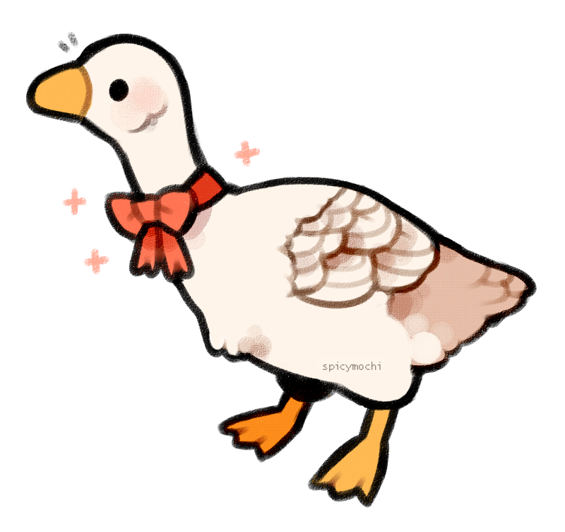

# Pond Goose

> | STR  | CON  | DEX  | INT  | WIS  | CHA  |
> | ---- | ---- | ---- | ---- | ---- | ---- |
> | +0   | +0   | +2   | -4   | +0   | +0   |
> | 11   | 10   | 14   | 3    | 9    | 10   |
>
> **Health** 21
> **Armour Class** 12
> **Speed** 40ft. (40ft. swim, 60ft. fly)
> **Proficiencies** Sleight of Hand +4, Stealth +2

#### Abilities

**Hold Breath.** You can hold your breath for 10 minutes while underwater.

#### Actions

**Beak.** *Melee Attack:* +2 to hit, reach 5 ft., one target. *Hit:* 1d6 + 2 piercing damage.

**Thieving Pecks.** The target creature must succeed on a Dexterity saving throw (DC12). On a failure, the target takes 1d6 piercing damage and you successfully steal the item. On a successful save, the target takes half as much damage and you don't steal the item. 

#### Bonus Actions

**Honk.**  *Special Action (3 / short rest):* You emit a honk at one creature within range. If the target can hear you, it must succeed on a Wisdom saving throw (DC10) or it will have disadvantage on the next ability check it makes before the end of its next turn.