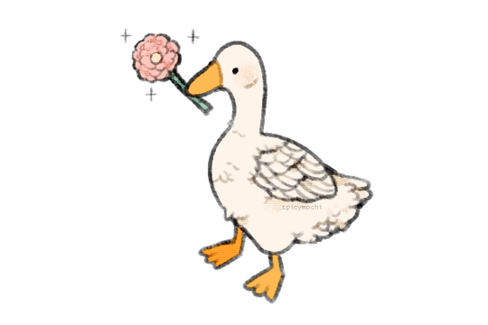

# Asparagoose

> | STR  | CON  | DEX  | INT  | WIS  | CHA  |
> | ---- | ---- | ---- | ---- | ---- | ---- |
> | -1   | +0   | +0   | -4   | +1   | +1   |
> | 8    | 10   | 10   | 3    | 13   | 13   |
>
> **Health** 24
> **Armour Class** 12
> **Speed** 40ft. (40ft. swim, 60ft. fly)
> **Proficiencies** Nature +4, Medicine +2

#### Abilities

**Hold Breath.** You can hold your breath for 10 minutes while underwater.

#### Actions

**Beak.** *Melee Attack:* +1 to hit, reach 5 ft., one target. *Hit:* 1d6 + 2 piercing damage.

**Vine Whip.** *Melee Spell Attack:* +3 to hit, reach 10ft., one target. *Hit:* 1d6 piercing damage, pull the creature up to 10ft. closer to you.

**Entangle.** *Area Spell Attack:* Grasping weeds and vines sprout from the ground in a 20-foot square. The ground in the area is now difficult terrain. A creature in the area when you cast the spell must succeed on a Strength saving throw or be [restrained](https://www.dndbeyond.com/compendium/rules/basic-rules/appendix-a-conditions#Restrained), only able to free themselves by using their action to make a Strength check (DC13).

#### Bonus Actions

**Honk.**  *Special Action (3 charges / short rest):* You emit a honk at one creature within range. If the target can hear you, it must succeed on a Wisdom saving throw (DC13) or it will have disadvantage on the next ability check it makes before the end of its next turn.
