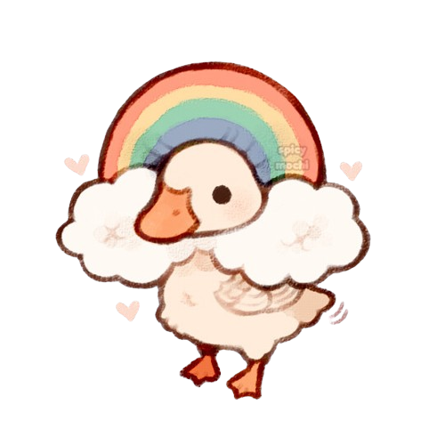

# LGooseBT

> | STR  | CON  | DEX  | INT  | WIS  | CHA  |
> | ---- | ---- | ---- | ---- | ---- | ---- |
> | -1   | +0   | +1   | -4   | -1   | +2   |
> | 9    | 10   | 12   | 3    | 9    | 14   |
>
> **Health** 20
> **Armour Class** 12
> **Speed** 40ft. (40ft. swim, 60ft. fly)
> **Proficiencies** Performance +4, Persuasion +2

#### Abilities

**Hold Breath.** You can hold your breath for 10 minutes while underwater.

#### Actions

**Beak.** *Melee Attack:* +1 to hit, reach 5 ft., one target. *Hit:* 1d6 + 2 piercing damage.

#### Bonus Actions

**Honk.**  *Special Action (3 / short rest):* You emit a honk at one creature within range. If the target can hear you, it must succeed on a Wisdom saving throw (DC14) or it will have disadvantage on the next ability check it makes before the end of its next turn.

**Yass.** *Support Action (2 / short rest):* Use your slay queen yass hunty vibes to give an ally [bardic inspiration](https://www.dndbeyond.com/classes/bard#BardicInspiration-75).
