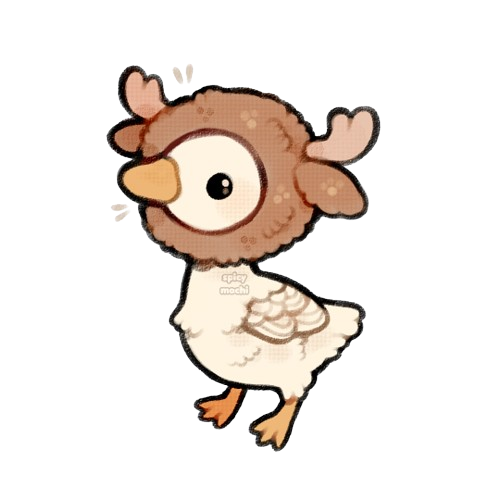

# Moose Goose

> | STR  | CON  | DEX  | INT  | WIS  | CHA  |
> | ---- | ---- | ---- | ---- | ---- | ---- |
> | +1   | +2   | +0   | -4   | -1   | +0   |
> | 12   | 14   | 10   | 3    | 8    | 10   |
>
> **Health** 38
> **Armour Class** 13
> **Speed** 40ft. (40ft. swim, 60ft. fly)
> **Proficiencies** Athletics +4, Intimidation +2 

#### Abilities

**Hold Breath.** You can hold your breath for 10 minutes while underwater.

#### Actions

**Beak.** *Melee Attack:* +3 to hit, reach 5 ft., one target. *Hit:* 1d6 + 2 piercing damage.

**Headbutt.** *Melee Attack:* +4 to hit, reach 5ft., one target. *Hit:* 1d8 + 2 bludgeoning damage. *Miss:* You are [stunned](https://www.dndbeyond.com/sources/basic-rules/appendix-a-conditions#Stunned) until the end of your next turn.

#### Bonus Actions

**Honk.**  *Special Action (3 / short rest):* You emit a honk at one creature within range. If the target can hear you, it must succeed on a Wisdom saving throw (DC12) or it will have disadvantage on the next ability check it makes before the end of its next turn.

#### Reactions

- [ ] **Endurance.** When you take damage, you can use your reaction to roll a d12. Add your Constitution modifier to the number rolled and reduce the damage by that total. 
